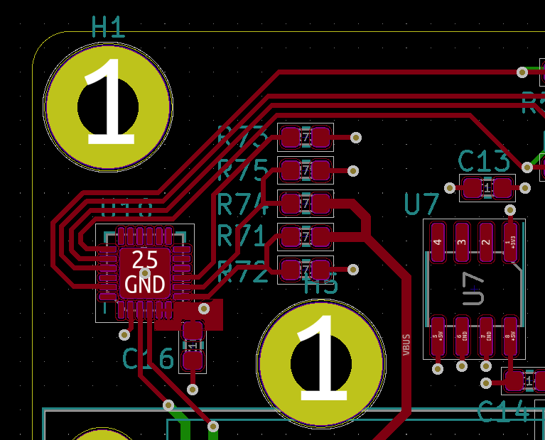
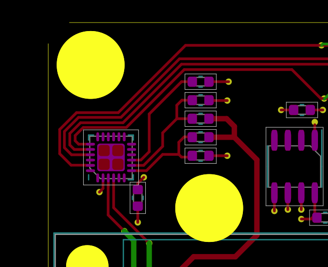
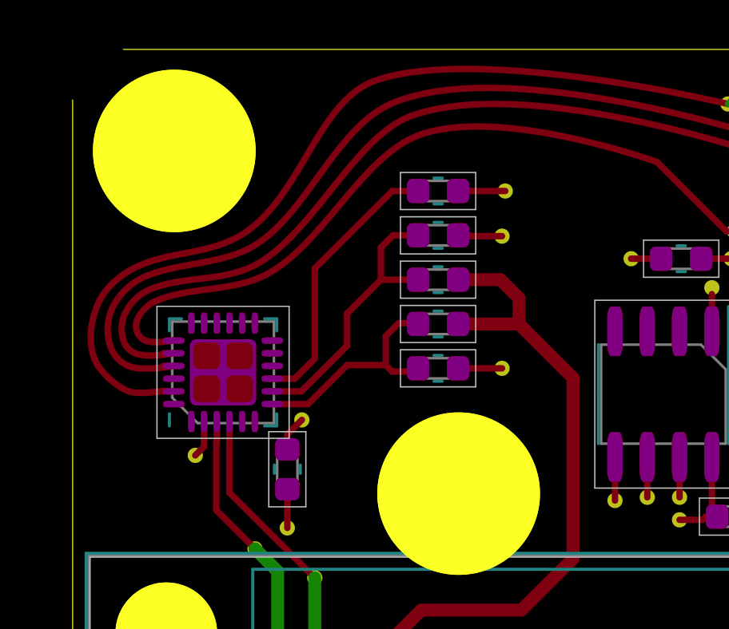
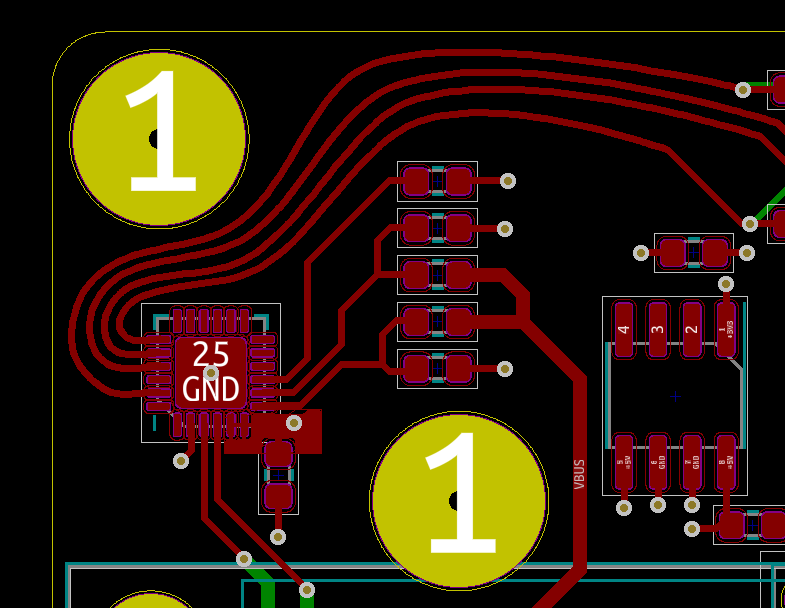

# Flex

Allow your PCBs to stretch!

## The Process

In KiCad:

In Inkscape:

Modify:

Back to KiCad:

## Usage

- Copy the Flex folder into your KiCad plugin folder
- Open up your KiCad project, and then your PCB in Pcbnew
- Hit the "UP" arrow in your plugin bar 
- There is now a file in your PCB directory called "out.svg". Open it in Inkscape, or your preferred vector software
- Make your modifications, and then save the SVG
- In Pcbnew, hit the "DOWN" arrrow 
- Close and then re-open your PCB window

In Inkscape, go to `Layer->Layers...` to display a window that will allow you to show/hide/view specific PCB layers. `Edit->XML Editor...` is also a good tool to debug why something isn't working, or see what's happening under the hood. 

## Limitations

Text or pours have not yet been implemented, and testing has been minimal. Properties such as locks or others that I have not yet encountered are also not yet implemented.

Closing the PCB window and opening it again is annoying - There may be a way to reload from disk. `pcbnew.Load()` or `pcbnew.PCB_IO().Load()` sound promising, but initial attempts just cause KiCad to hang.

Metadata that doesn't need to be processed, or do not yet have processors written are stored as-is so they can be dumped back into the PCB wholesale.

Some properties, such as layers, are processed / stored with Inkscape-specific metadata, and may not be handled very well with other software. Additionally, this was written literally _the day before_ Inkscape 1.0 came out, so this has only been tested with Inkscape 0.92 .

This is currently kind of a hack. Obviously, save and backup everything before using this, and **check check check** your gerbers before purchasing anything.

I am happy accept issues, or pull requests, and example PCBs that break the software. I may be slow to fix issues on myself, so feel free to dive in!